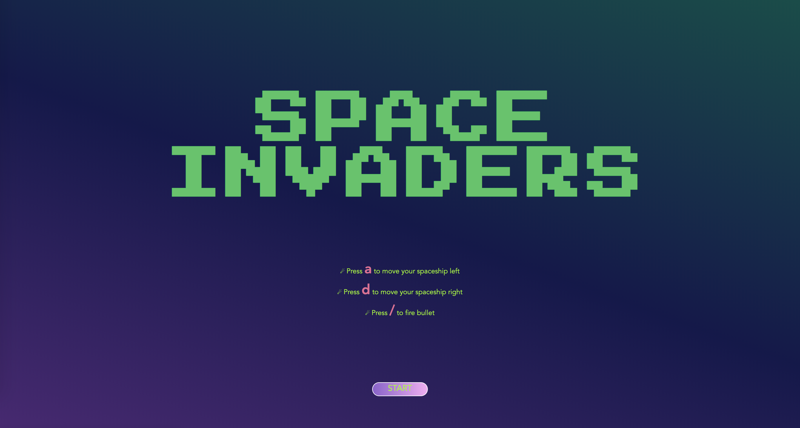
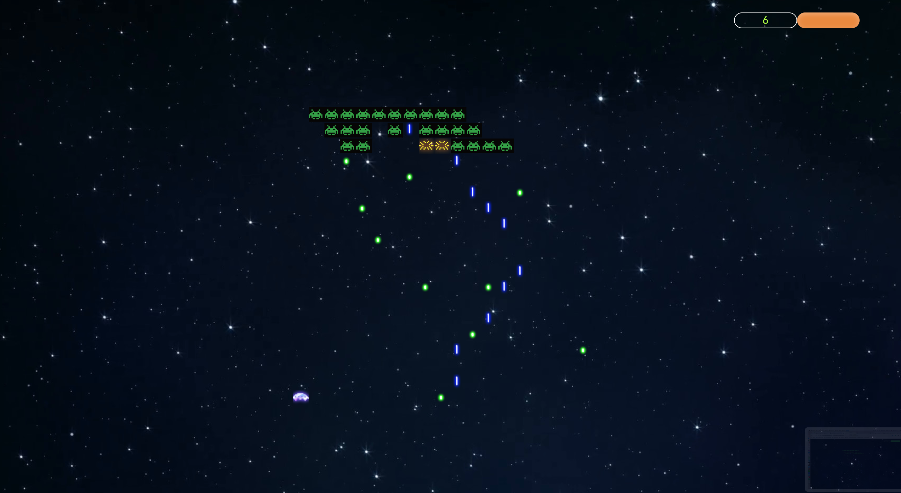
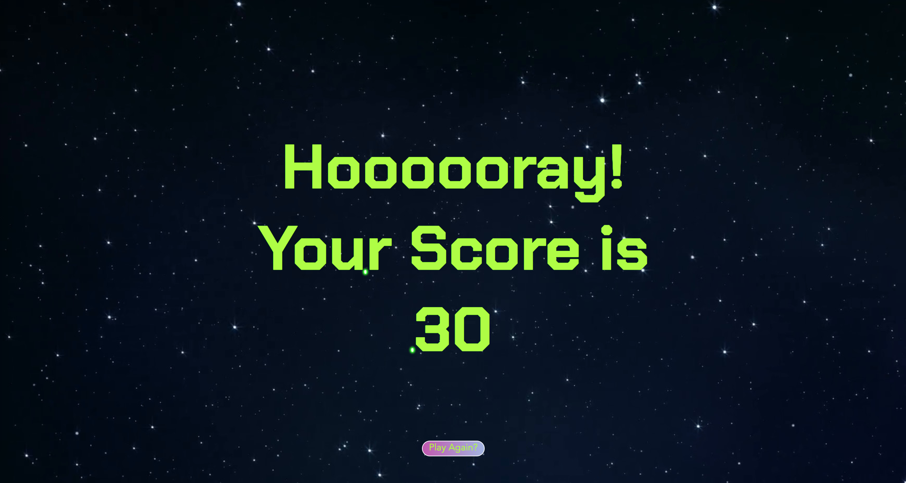

# SEI-Project-1: Space Invaders (Vanilla Javascript)


## Timeframe

7 days

## Front-end game developing

First personal project developed while studying at General Assembly.

## Technical requirements

* Render a game in the browser
* Switch turns between two players
* Design logic for winning & visually display which player won
* Include separate HTML / CSS / JavaScript files
* Use Javascript for DOM manipulation

## About the game

**Space invaders**

* Space Invaders is a classic arcade game from the 80s. The player aims to shoot an invading alien armada, before it reaches the planet's surface using a mounted gun turret.

* The player can only move left or right. The aliens also move from left to right, and also down each time the reach the side of the screen. The aliens also periodically drop bombs towards the player.

* Once the player has destroyed a wave of aliens, the game starts again. The aim is to achieve the highest score possible before either being destroyed by the aliens, or allowing them to reach the planet's surface.

[Have a go now](https://sei44-project-1-xxxc.netlify.com)

:space_invader: :space_invader: :space_invader:

## Game setting

* The game is based on 20 * 20 grids, I created the divs using for loop, and push them to an empty array. We also want to append these divs to our HTML so we have access to them while setting other objects up.

* The aliens movement is based on numbers increasing and decreasing of a hard coded array. While the number is changing, we remove and add the alien CSS class to the grids.

* I used setInterval function for the bombs that aliens is droping. SetInterval is also used to control the bullet and bombs's moving track. 

* Usually the player would have 3 lives, and he will lose one once got hit by the bomb. I use a progress bar to display the player's life, made it has a small touch of the 80s street fighter.








## Challanges

* The biggest challange of this game that I've come across is to make the aliens to move. I have tried to only remove one specific alien from both end of the line each time when the line moves. I used setInterval to remove the first 3 ones from the left and use setTimeout to control a setInterval to remove another 3 from the right. It did move for 5 secs but then the delayed timer just doesn't work out for a longer period of time. But it was fun, think we might be able to make some delay music app by using this method.

```javascript
let line  = [0, 1, 2, 3, 4, 5]

line.forEach(num => {
  cells[num].classList.add('alien')
})

const goRight = setInterval(right, 500)

function right () {
  if (!line[5] === 9){
    line = line.map(x => x + 1)
    console.log(line)
    line.some(num => {
      cells[num].classList.add('alien')
    })
  }
  if (line[5] === 9) {
    clearInterval(goRight)
  } 
}

setTimeout(() => {
  const goLeft = setInterval(left, 1000)
  function left () {
    line = line.map(x => x - 1)
    console.log(line)
    line.some(num => {
      cells[num].classList.add('alien')
    })
    if (line[0] === 0) {
      clearInterval(goLeft)
    }
  }
}, 2000)
```

* Second of all, it was a big challange for me as well to stop my bullet and bomb setIntervals while developing this game. I tried out several different ways to clear it. Some of them works (like creating a function called intervalManager and use boolean to control your setIntervals) but doesn't fit for the purpose at the end. I have achived these as a reference for later.

```javascript
function alienIntervalManager (flag, animate, time) {
    if (flag) {
      moveAliensId = setInterval(animate, time)
    } else {
      clearInterval(moveAliensId)
    }
  }
  
alienIntervalManager(true, alienmove, 500)
// or
alienIntervalManageer(false)
```

## Wins

* Pseudo code

* Progress bar for the player's life as a little detail

* Put up together the startGame function, and sucessfully fixed the reset button function

* Start and reset the page

* CSS animation styling

## Future Features

- Audio sounds

- When the bullet and the bomb are in the same grid, they will be able to both disapear. (using JS class to track all bullets and bombs movement, each of them will be unique and can be removed when needed)

- More waves of aliens. The game will never ends, and the player will only be defeated while got git three times or the aliens reach the player's grid level. (hard coded the original alien array, and let the new alien array be editable, in every 10 secs, a NEW original alien array will be generated)

- Score board for different players. (using localStorage) 
